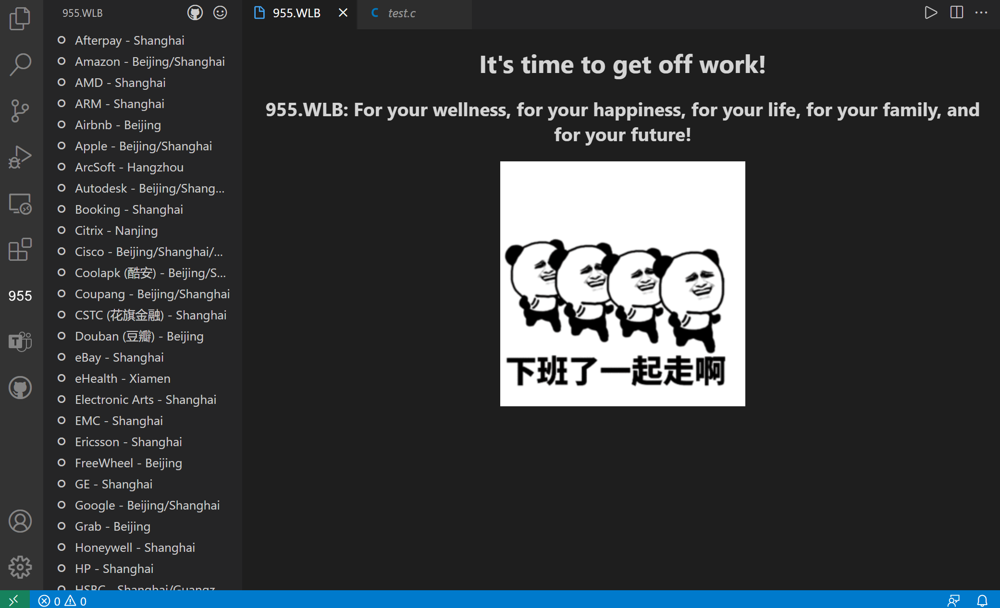

# 955.WLB

955 Work system: Start work at 9 AM, and work until 5 PM. Work 5 days a week.

[955.WLB](https://github.com/formulahendry/955.WLB): For your wellness, for your happiness, for your life, for your family, and for your future!

## Features

* Showing reminder to get off work when it is 5:30 PM on workday (you could change the time in configuration).

* Show list of 955.WLB companies in Tree View.

* Search 955.WLB companies.

## Configuration

* `955-wlb.cronExpression`: Cron Expression for showing reminder to get off work. (default value is `30 17 * * 1-5`)